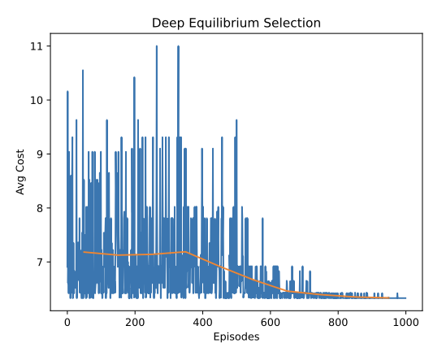

# Smart Routes, Smarter Agents

This project investigates equilibrium selection in **multi-agent routing games**, where self-interested agents may converge to stable but socially inefficient routing decisions.

We introduce **Deep Equilibrium Selection (DES)**, a multi-agent reinforcement learning approach that combines deep Q-learning with ideas from potential games, Marginal Contribution Utility, and log-linear learning. By modifying agent rewards to account for their impact on system-wide congestion, DES encourages decentralized agents to converge toward socially optimal equilibria.

## Approach

We model dynamic routing as a **Markov Routing Game** and compare three approaches:

- **Independent Deep Q-Learning (IDQL)** — each agent independently learns a routing policy using global state information.
- **Mean Field Deep Q-Learning (MF-DQL)** — agents approximate interactions with other agents through mean actions.
- **Deep Equilibrium Selection (DES)** — our proposed approach, which uses a marginal-contribution-based reward function and log-linear action selection to align individual incentives with global routing efficiency.

DES modifies each agent's reward to account for the congestion cost it imposes on other agents. The Q-function is approximated using a neural network, allowing the equilibrium-selection framework to be applied in a sequential routing environment.

## Results

Experiments are conducted on modified Braess networks with 10 agents.

On the adapted Braess network:

| Method | Average Cost |
| --- | ---: |
| Global Optimum | **6.33** |
| DES | **6.33** |
| IDQL | 6.42 |
| MF-DQL | 6.64 |

DES converges to the global optimum, while the baseline approaches converge to higher-cost solutions. The modified reward structure also makes the globally optimal configuration a stable Nash Equilibrium under the new incentives.

  

## Report

📄 **[Read the full project report](https://drive.google.com/file/d/1WdXNCeDgPuFRB66CTD8Zs3Gcfh4PFiuk/view)**

The report contains the full game-theoretic formulation, algorithm descriptions, adapted Braess network experiments, convergence results, and discussion of the conditions under which DES improves on conventional MARL approaches.
